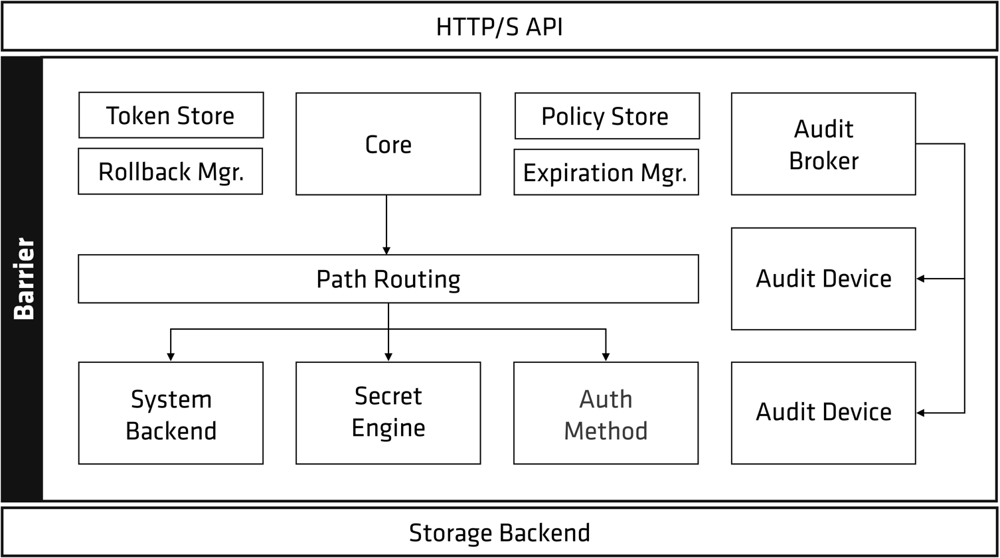
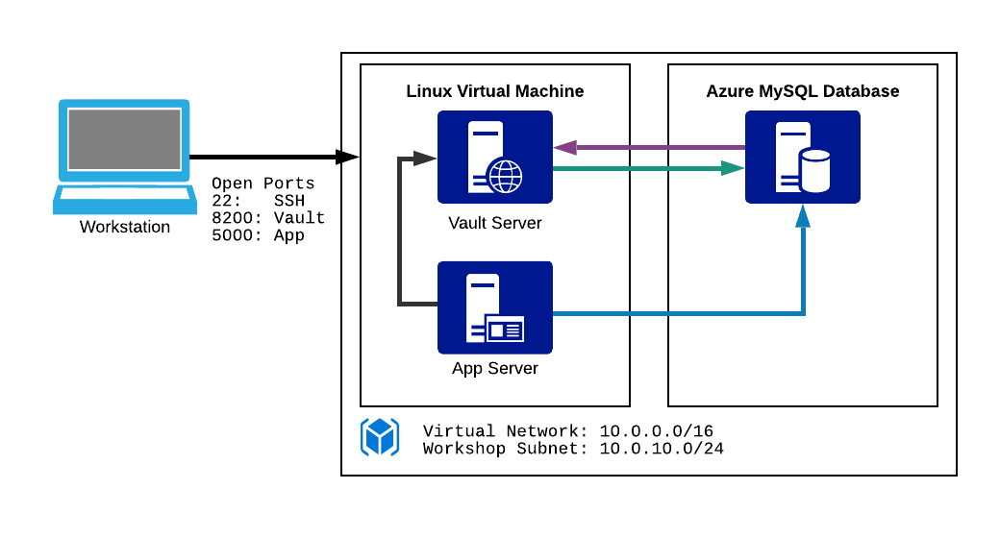
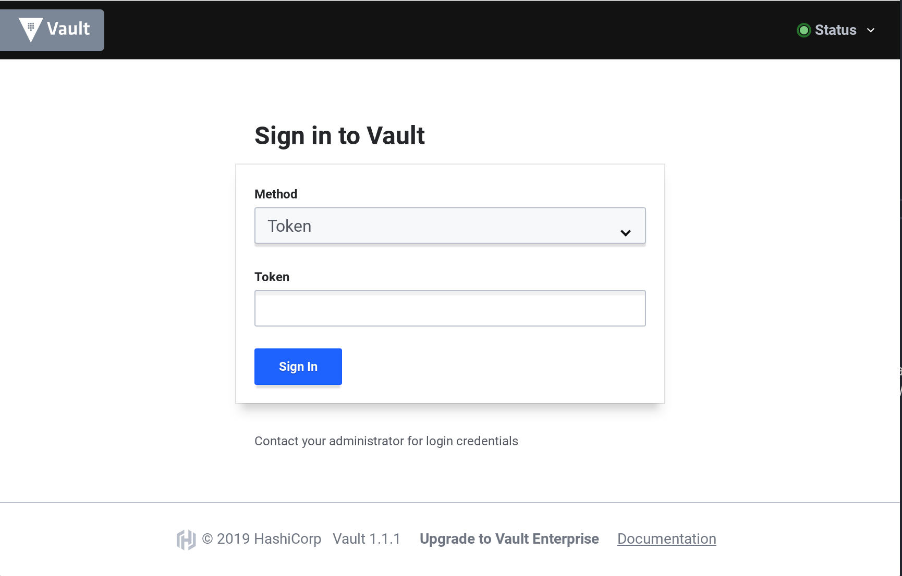
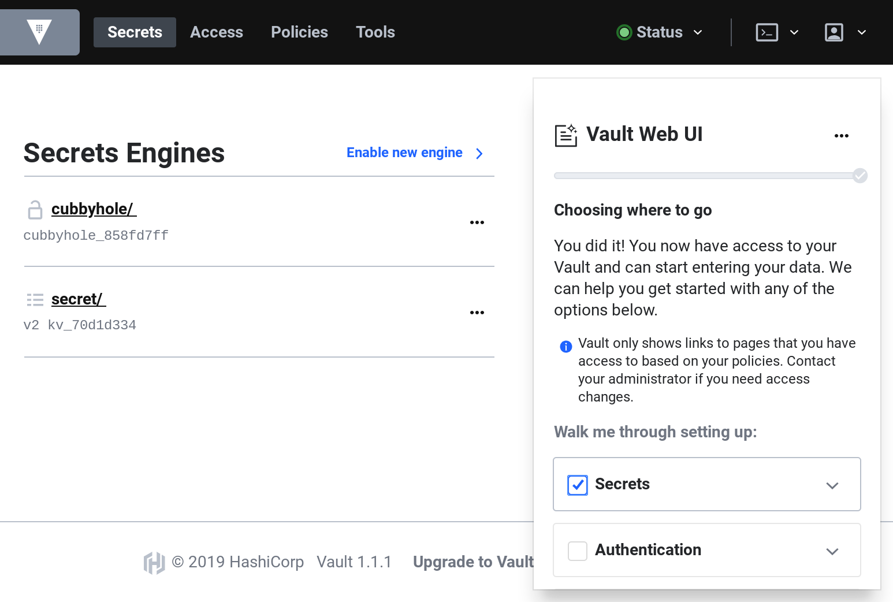
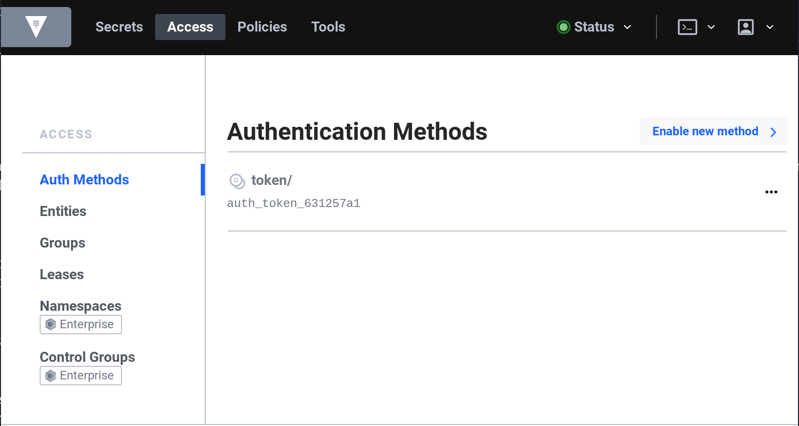

name: Azure-Terraform-Vault-Workshop
class: center,middle,title-slide
count: false

.titletext[
Azure Vault Workshop]
Modern Security With Vault

???
Welcome to the beginner's guide to Vault on Azure. 

---
name: Link-to-Slide-Deck
The Slide Deck
-------------------------
<br><br><br>
.center[
Follow along on your own computer at this link:

https://bit.ly/359nM39
=========================
]

---
name: Introductions
Introductions
-------------------------

.contents[
* Your Name
* Job Title
* Automation Experience
* Favorite Text Editor
]

???
Use this slide to introduce yourself, give a little bit of your background story, then go around the room and have all your participants introduce themselves.

The favorite text editor question is a good ice breaker, but perhaps more importantly it gives you an immediate gauge of how technical your users are.  

**There are no wrong answers to this question. Unless you say Notepad. Friends don't let friends write code in Notepad.**

**If you don't have a favorite text editor, that's okay! We've brought prebuilt cloud workstations that have Visual Studio Code already preinstalled. VSC is a free programmer's text editor for Microsoft, and it has great Terraform support. Most of this workshop will be simply copying and pasting code, so if you're not a developer don't fret. Terraform is easy to learn and fun to work with.**

---
name: Table-of-Contents
class: center,middle
Table of Contents
=========================

.contents[

0. HashiCorp Vault Overview
1. Vault Lab Environment
1. Interacting with Vault (CLI, GUI, API)
1. Authenticating to Vault: Auth Methods
1. Vault Secrets Engines
1. Authorization in Vault: Policies
1. Encryption as a Service
1. Namespaces and Sentinel
]

???
TODO: Speaker talk track for the table of contents.

---
name: Chapter-1
class: center,middle
.section[
Chapter 1  
HashiCorp Vault Overview
]

---
name: HashiCorp-Vault-Overview
HashiCorp Vault Overview
-------------------------
<br>
.center[

]

HashiCorp Vault is an API-driven, cloud agnostic secrets management system. It allows you to safely store and manage sensitive data in hybrid cloud environments. You can also use Vault to generate dynamic short-lived credentials, or encrypt application data on the fly.

???
This is meant as a high level overview.  For detailed descriptions or instructions please see the docs, API guide, or learning site:
* https://www.vaultproject.io/docs/
* https://www.vaultproject.io/api/
* https://learn.hashicorp.com/vault/

---
name: The-Old-Way
The Traditional Security Model
-------------------------
.center[]
.center[Also known as the "Castle and Moat" method.]

???
TODO: Put Stephen's talk track in here.

Traditional security models were built upon the idea of perimeter based security.  There would be a firewall, and inside that firewall it was assumed one was safe.  Resources such as databases were mostly static.  As such rules were based upon IP address, credentials were baked into source code or kept in a static file on disk.

* IP Address based rules
* Hardcoded credentials with problems such as:
  * Shared service accounts for apps and users
  * Difficult to rotate, decommission, and determine who has access
  * Revoking compromised credentials could break 

---
name: The-New-Way
Modern Secrets Management
-------------------------
.center[]
.center[No well defined permieter; security enforced by identity.]

???
These are Mongolian Yurts or "Ger" as they are called locally. Instead of a castle with walls and a drawbridge, a fixed fortress that has an inside and an outside, these people move from place to place, bringing their houses with them.

And if you don't think the Nomadic way can be an effective security posture, think about this for a moment. The Mongol military tactics and organization enabled the Genghis Khan to conquer nearly all of continental Asia, the Middle East and parts of eastern Europe. Mongol warriors would typically bring three or four horses with them, so they could rotate through the horses and go farther. Mongol army units could move up to 100 miles a day, which was unheard of in the 13th century. They were faster, more adaptable, and more resilient than all their enemies.

---
name: Identity-Based-Security
Identity Based Security
-------------------------
.center[]
.center[Identity Based Security in Low Trust Networks
https://www.hashicorp.com/identity-based-security-and-low-trust-networks]

???
Vault was designed to address the security needs of modern applications.  It differs from the traditional approach by using:

* Identity based rules allowing security to stretch across network perimeters
* Dynamic, short lived credentials that are rotated frequently
* Individual accounts to maintain provenance (tie action back to entity)
* Easily invalidate credentials or entities

---
name: Secrets-Engines
Multi-tool for Secrets Management
-------------------------
.center[]
.center[Store and manage any type of secret with different engines
https://www.hashicorp.com/identity-based-security-and-low-trust-networks]

---
name: Vault-Reference-Architecture-1
Vault Architecture - Internals
-------------------------
.center[]
.center[HashiCorp Vault Internals Reference Architecture
https://www.vaultproject.io/docs/internals/architecture.html
]

---
name: Vault-Reference-Architecture-2
Vault Architecture - High Availability
-------------------------
.center[]
.center[Vault High Availability Architecture
https://learn.hashicorp.com/vault/operations/ops-reference-architecture
]

---
name: Vault-Reference-Architecture-3
Vault Architecture - Multi-Region
-------------------------
.center[]
.center[Vault Multi-Region Architecture
https://learn.hashicorp.com/vault/operations/ops-reference-architecture
]

---
name: Vault-Seal
Vault Architecture - Vault Seal
-------------------------
When a Vault server is started, it starts in sealed - doesn't know how to decrypt the data

Unsealing is the process of constructing the master key necessary to read the decryption key to decrypt data

Why?
* The data stored by Vault is encrypted with encryption key
* The encryption key is encrypted with master key
* The master key is NOT stored anywhere

---
name: Vault-Seal-2
Vault Architecture - Vault Seal
-------------------------
.center[]

---
name: Vault-Autounseal
Vault Architecture - Vault Autounseal
-------------------------
.center[]

---
name: chapter-1-exercise-1
.center[.lab-header[Chapter 1: Exercise 1]]
<br>
### Connect to Azure and Setup Environment
* If you completed Terraform 101 workshop, you should be ready to go for this class
* Otherwise, connect into Azure Portal, open cloudshell, git clone this repo, cd into solutions/azure/terraform/chapter5 and run terraform init/terraform apply
- https://portal.azure.com
- Open Cloud Shell
- git clone https://github.com/hashicorp/workshops
- cd workshops/solutions/azure/terraform/oss+ent101/chapter5
- `terraform init`
- `terraform apply`

---
name: chapter-1-review
📝 Chapter 1 Review
-------------------------
.contents[
What is HashiCorp Vault?
]

---
name: chapter-1-review
📝 Chapter 1 Review
-------------------------
.contents[
What is HashiCorp Vault?
* Open source secrets management system
]

---
name: chapter-1-review
📝 Chapter 1 Review
-------------------------
.contents[
What is HashiCorp Vault?
* Open source secrets management system
* Supports multi-cloud, hybrid environments
]

---
name: chapter-1-review
📝 Chapter 1 Review
-------------------------
.contents[
What is HashiCorp Vault?
* Open source secrets management system
* Supports multi-cloud, hybrid environments
* Identity-based security
]

---
name: chapter-1-review
📝 Chapter 1 Review
-------------------------
.contents[
What is HashiCorp Vault?
* Open source secrets management system
* Supports multi-cloud, hybrid environments
* Identity-based security
* Manage secrets on untrusted networks
]

---
name: chapter-1-review
📝 Chapter 1 Review
-------------------------
.contents[
What is HashiCorp Vault?
* Open source secrets management system
* Supports multi-cloud, hybrid environments
* Identity-based security
* Manage secrets on untrusted networks
* Secure apps and infrastructure everywhere
]

---
name: chapter-1-review
📝 Chapter 1 Review
-------------------------
.contents[
What is HashiCorp Vault?
* Open source secrets management system
* Supports multi-cloud, hybrid environments
* Identity-based security
* Manage secrets on untrusted networks
* Secure apps and infrastructure everywhere
* Highly available, production ready
]

---
name: chapter-1-review
📝 Chapter 1 Review
-------------------------
.contents[
What is HashiCorp Vault?
* Open source secrets management system
* Supports multi-cloud, hybrid environments
* Identity-based security
* Manage secrets on untrusted networks
* Secure apps and infrastructure everywhere
* Highly available, production ready
* Trusted by industry and government
]

---
name: chapter-1-review
📝 Chapter 1 Review
-------------------------
.contents[
What is HashiCorp Vault?
* Open source secrets management system
* Supports multi-cloud, hybrid environments
* Identity-based security
* Manage secrets on untrusted networks
* Secure apps and infrastructure everywhere
* Highly available, production ready
* Trusted by industry and government
* Enterprise version with extra features
]

---
name: Chapter-2
class: center,middle
.section[
Chapter 2      
Vault Lab Environment
]

---
name: Your-Lab-Environment
Your Lab Environment 
-------------------------
.center[]
Some of the lab exercises will ask you to run commands on the Linux server where Vault is installed. Vault can be managed via the command line, the GUI, or via the API.

???
During the Terraform Workshop we deployed a pre-configured Vault server, an Azure MySQL database. The Linux server here in the diagram is doing double duty. It's running vault and it will also be where we run most of our lab commands.

Reminder: This is a lab training environment and we are doing some things here that you should never do in production. There is no SSL encryption configured, and Vault is running in memory on a single machine in development mode. 

---
name: chapter-2-exercise-1
.center[.lab-header[Chapter 2: Exercise 1]]
### Deploy Vault
* SSH into Vault Server using credentials from the outputs
* Initialize, Unseal, and Authenticate to Vault using the initial root token.
* View status of vault
* Lookup token information

https://learn.hashicorp.com/vault/getting-started/deploy#initializing-the-vault
https://www.vaultproject.io/docs/commands/status.html
https://www.vaultproject.io/docs/commands/token/lookup.html

`HINT 1: Vault CLI assumes Vault is installed on the localhost using TLS. Google VAULT_ADDR environment variable to see how to change that setting`

`HINT 2: Copy the unseal keys and initial root token somewhere safe`

`HINT 3: Vault Enterprise will shutdown after 30 minutes without a license file and error out during the unseal process. If this occurs to you, run "sudo service vault restart`

<br><br><br>
.footnote[.right[[s](https://github.com/hashicorp/se-terraform-vault-workshop/tree/master/solutions/azure/vault/oss+ent101/chapter2)]]

---
name: chapter-2-exercise-2
.center[.lab-header[Chapter 2: Exercise 2]]
### Enterprise License
* Write the license file provided by the Trainer into /sys/license
* Verify that vault license is installed

https://www.vaultproject.io/api/system/license.html  

`HINT 1: The license can also be installed from the UI or by writing to the sys/license path with text=<license>`
<br><br><br>
.footnote[.right[[s](https://github.com/hashicorp/se-terraform-vault-workshop/tree/master/solutions/azure/vault/oss+ent101/chapter2)]]
???

---
name: chapter-2-review
📝 Chapter 2 Review
-------------------------
.contents[
Your Lab Environment
* Linux server and Azure MySQL database
* Vault and application are on the Linux server
* Ports 8200, and 22 are open
* Don't do this in production
]

---
name: Chapter-3
class: center,middle
.section[
Chapter 3
Interacting with Vault
]

---
name: Getting-Connected-GUI-1
Connect to Your Vault Server - GUI
-------------------------
During the Terraform workshop we learned the `terraform output` command. Run this command now to show the command for connecting to your Vault server via SSH. Remember to run this from within the `azure` subdirectory where all your terraform files are. The command is CaSe Sensitive!

Command:
```powershell
terraform output
```

---
name: Getting-Connected-GUI-2
Connect to Your Vault Server - GUI
-------------------------
.center[]
Open the Vault server URL in a web browser. Log in with the master token, which is simply `root`. (Don't do this in production!)

---
name: Getting-Connected-GUI-3
The Vault Server GUI
-------------------------
.center[]
When you first log onto a new Vault server you'll see an invitation to take a tour. You can always get back to the Welcome Tour by clicking the menu in the upper right corner and selecting "Restart Guide".

---
name: chapter-3a-lab
.center[.lab-header[Lab Exercise 3a: Secrets Guide]]
<br>
.center[]
Go through the first part of the Welcome Tour and create a key/value secrets engine with the default mount path of `kv`, and `department/team/mysecret` for the path to your secret. Use `rootpass` for the Key and `supersecret` for the Value.

???
This will all make more sense as you go through the tutorial. Walk through it and see if you can figure it out.

---
name: chapter-3a-lab-answers
.center[.lab-header[Lab Exercise 3a: Answers]]
<br><br><br>
You can follow the steps in the 'Secrets' section of the Welcome Tour to enable a new Key/Value secrets engine and store a secret.

1. Start the tour. Under the **Enable Secrets Engine** page select the KV option and click on the **Next** button.
1. On the next page leave the default setting of `kv` and click **Enable Engine**.
1. Click on **Create Secret** and enter `department/team/mysecret` where it asks for a path.
1. Scroll down and enter `rootpass` for the Key and `supersecret` for the Value. Click on the **Save** button at the bottom.

Congratulations, you just stored your first secret in HashiCorp Vault!

---
name: Getting-Connected-CLI-1
The Vault Command Line Interface
-------------------------
Vault is distributed as a single binary file, which means it can act as both a server or a command line client. We're going to SSH onto the Vault server and run some vault commands locally.

Command:
```powershell
terraform output
```


---
name: Getting-Connected-CLI-2
The Vault Command Line Interface
-------------------------
In Visual Studio Code, open a new Terminal window and paste the ssh command from your terraform output into the terminal. The command below is an example. Yours will contain your own username where YOURNAME is.


Commands:
```powershell
ssh hashicorp@YOURNAME.centralus.cloudapp.azure.com
```

---
name: Getting-Connected-CLI-3
The Vault Command Line Interface
-------------------------
Vault is already preconfigured to communicate with the server running on the local machine. Remember that all interactions with Vault, whether through the GUI, or command line always have an underlying API call. Run the following commands to see Vault's environment variables.

Commands:
```bash
echo $VAULT_ADDR
echo $VAULT_TOKEN
```

Outputs:
```tex
http://localhost:8200
root
```

The Vault CLI has many other settings which you can read about here:
.center[https://www.vaultproject.io/docs/commands/]

???
At a minimum Vault needs two pieces of information. Where is the Vault server, and what token are we using to communicate with it?

Note that even the command line tool uses that API to communicate with Vault. Same goes for the GUI.

---
name: Vault-Status
Vault Status
-------------------------
Let's try a few basic Vault commands, starting with `vault status`:

Command:
```bash
vault status
```

Output:
```tex
Key             Value
---             -----
Seal Type       shamir
Initialized     true
Sealed          false
Total Shares    1
Threshold       1
Version         1.1.1
Cluster Name    vault-cluster-db6f271d
Cluster ID      33e85d7c-63bb-7523-0165-9d1aee722d70
HA Enabled      false
```

`vault status` gives us some basic information about the Vault cluster.

---
name: Vault-Help
Vault Help
-------------------------
`vault --help` will show you a list of available subcommands. You can also run `vault subcommand --help` to get more information:

Command:
```bash
vault --help
```

Output:
```tex
Usage: vault <command> [args]

Common commands:
    read        Read data and retrieves secrets
    write       Write data, configuration, and secrets
    delete      Delete secrets and configuration
    list        List data or secrets
    login       Authenticate locally
    agent       Start a Vault agent
    server      Start a Vault server
    status      Print seal and HA status
    unwrap      Unwrap a wrapped secret
...
```

---
name: Vault-Autocomplete
Vault Autocomplete
-------------------------
<br><br>
Vault has a handy autocomplete feature. You can simply hit the [TAB] key while typing commands and it will offer useful autocomplete suggestions. Install Vault autocomplete with these commands:

Command:
```bash
vault -autocomplete-install
source ~/.bashrc
```

These commands have no output if they run successfully. You can test the autocomplete feature by typing `vault` and then hitting the [TAB] key a few times.

---
name: Vault-KV-Command
Vault KV
-------------------------
The `vault kv` command allows you to interact with Key/Value engines like the one you created in the previous lab. Try running `vault kv list` on the KV secrets engine you mounted to see what's inside:

Commands:
```bash
vault kv list kv
vault kv list kv/department
vault kv list kv/department/team
```

Output:
```tex
Keys
----
mysecret
```

---
name: chapter-3b-lab
.center[.lab-header[Lab Exercise 3b: Retreive a Secret]]
<br><br><br>
Retreive the secret you stored in the first lab with the `vault kv get` command. Try and figure this one out on your own before looking at the answer.

Hint: You'll need the full path to your secret on the server.

---
name: chapter-3b-lab-answer
.center[.lab-header[Lab Exercise 3b: Answer]]
<br><br>
Reading secrets via the command line is easy. You can get the latest version of your secret with this command:

Command:
```bash
vault kv get kv/department/team/mysecret
```

Output:
```tex
====== Metadata ======
Key              Value
---              -----
created_time     2019-05-07T13:52:50.929656328Z
deletion_time    n/a
destroyed        false
version          1

====== Data ======
Key         Value
---         -----
*rootpass    supersecret
```

---
name: Getting-Connected-API-1
The Vault API
-------------------------
Vault has a full RESTful API which you can use to configure Vault and manage your secrets. Let's test the API with a simple cURL command. Here we are checking the sys/health endpoint and using jq to format the JSON output.

Command:
```bash
curl http://localhost:8200/v1/sys/health | jq
```

Output:
```json
{
  "initialized": true,
  "sealed": false,
  "standby": false,
  "performance_standby": false,
  "replication_performance_mode": "disabled",
  "replication_dr_mode": "disabled",
  "server_time_utc": 1557180149,
  "version": "1.1.1",
  "cluster_name": "vault-cluster-db6f271d",
  "cluster_id": "33e85d7c-63bb-7523-0165-9d1aee722d70"
}
```

---
name: Getting-Connected-API-2
The Vault API
-------------------------
The sys/health endpoint didn't require any authentication, but most of your API calls will be authenticated. Let's read that secret we created earlier using our root token. Be sure to copy and paste both lines together.

Command:
```bash
curl --header "X-Vault-Token: root" \
http://localhost:8200/v1/kv/data/department/team/mysecret | jq .data
```

Output:
```json
{
  "data": {
    "rootpass": "supersecret"
  },
  "metadata": {
    "created_time": "2019-05-06T21:42:39.022036021Z",
    "deletion_time": "",
    "destroyed": false,
    "version": 1
  }
}
```

---
name: chapter-3c-lab
.center[.lab-header[Lab Exercise 3c: API Calls]]
<br><br><br><br>
In this lab we'll look up information about your current token. Create a curl command like the one we used previously to query the `v1/auth/token/lookup-self` endpoint.

---
name: chapter-3c-lab-answer
.center[.lab-header[Lab Exercise 3c: Answer]]
<br><br>
Command:
```bash
curl --header "X-Vault-Token: root" \
http://localhost:8200/v1/auth/token/lookup-self | jq
```

Output:
```json
{
  "accessor": "bPNHDP8WDW4YgejBLvJm10I2",
  "creation_time": 1557168937,
  "creation_ttl": 0,
  "display_name": "token",
  "entity_id": "",
  "expire_time": null,
  "explicit_max_ttl": 0,
  "id": "root",
  "issue_time": "2019-05-06T18:55:37.270794189Z",
  "meta": null,
  "num_uses": 0,
  "orphan": true,
  "path": "auth/token/create",
...
```

---
name: chapter-3-review
📝 Chapter 3 Review
-------------------------
<br>
.contents[
Interacting with Vault
* 3 ways to interact with Vault - GUI, CLI, API
* Everything maps back to an API call
* A valid token is required for most requests
* Authenticated users and apps can get tokens
* The root token is special, not for everyday use
* Access level is based on *policy*
]

???
So far we've been doing everything as the root or superuser. In the next chapter we'll learn how to create policies that can limit what your users and applications can do with Vault.

---
name: Chapter-4
class: center,middle
.section[
Chapter 4
Authenticating to Vault: Auth Methods
]

---
name: Vault-Authentication
Vault Auth Methods
-------------------------
.center[]
Vault supports many different authentication methods. You can enable multiple auth methods, or multiple instances of the same auth method.

???
Auth methods are how your apps and users verify their identity. In the same way you might present some kind of valid ID at the hotel check-in desk, users and apps provide some kind of credential or token to authenticate.

---
name: Vault-Authentication-0
Vault Auth Method: UserPass
-------------------------
.center[]
The simplest authentication method (besides using a token directly) is the userpass method. As the name implies, these are local user accounts on the Vault server itself.

???
In the real world you'd probably have Vault use your Active Directory, LDAP or other system of record for authentication.

The userpass method of authentication is not recommended for production, but it's fine for development and lab environments.

We're keeping it simple here. Userpass does not require an active directory server or any other external provider to work.

---
name: Vault-Authentication-1
Vault Auth Method: UserPass
-------------------------
.center[]
<br>
Let's enable the userpass authentication method in Vault. Click on the **Access** link in the top menu, then select **Enable New Method**.

---
name: Vault-Authentication-2
Vault Auth Method: UserPass
-------------------------
<br><br>
.center[]
<br>
Select the **Username and Password** box and click **Next** at the bottom of the page.

---
name: Vault-Authentication-3
Vault Auth Method: UserPass
-------------------------
<br><br>
.center[]
<br>
Leave the default path of **userpass** and click on **Enable Method**. The userpass authentication method is now mounted at the `userpass/` API endpoint.

---
name: Vault-Authentication-4
Vault Auth Method: UserPass
-------------------------
Next, let's create a couple of users. These steps need to be done on the command line. Make sure you are SSH'd into the Vault server when you run these commands. Copy and paste the below commands into your terminal:

Commands:
```bash
vault write auth/userpass/users/bob \
    password=foo \
    policies=secret

vault write auth/userpass/users/sally \
    password=foo \
    policies=lob_a
```

Output:
```tex
Success! Data written to: auth/userpass/users/bob
Success! Data written to: auth/userpass/users/sally
```

???
Notice the policy section.  Policies are mapped to authentication endpoints.  Tokens generated from those endpoints have the policies assigned to it.

---
name: chapter-4-exercise
.center[.lab-header[Chapter 4: Exercise]]
### Auth Method 1
* Enable and configure userpass auth method.

https://www.vaultproject.io/docs/auth/userpass.html
<br><br><br>
### Auth Method 2
* Enable and configure azure auth method.

https://www.vaultproject.io/docs/auth/azure.html  

`HINT 1: Use the tenant_id, application_id, and service_principal_password provided along with your Azure credentials.`

`HINT 2: Query the resource https://management.azure.com/`
<br><br>
.footnote[.right[[s](https://github.com/hashicorp/se-terraform-vault-workshop/tree/master/solutions/azure/vault/oss+ent101/chapter4)]]

---
name: chapter-4-review
📝 Chapter 4 Review
-------------------------
<br>
.contents[
Vault Authentication Methods
* Supports over a dozen auth methods
* Policies assigned to a token after auth
* Multiple policies can be assigned to an entity
* Policies prevent unauthorized access
* The default policy in vault is *deny*
]

---
name: Chapter-5
class: center,middle
.section[
Chapter 5      
Vault Secrets Engines
]

---
name: Vault-Secrets-Engines
Vault Secrets Engines
-------------------------
.center[]
HashiCorp Vault ships with many different secrets engines. Some are for storing secrets, others can dynamically manage credentials or even provide encryption as a service.

???
Spend some time pointing out what some of these do:
* KV - we've already got some experience with this one. Supports versioning, which we don't cover in this workshop.
* PKI - If you ever have to manage SSL certificates this one is for you.
* SSH - Take all the pain and drudgery out of securing your SSH infrastructure. Vault can provide key signing services that make securing SSH a snap.
* Transit - Imagine if you had an API that could handle all your encryption and decryption needs, based on policy, without ever having to manage a complicated key infrastructure. Vault Transit - Encryption as a Service
* TOTP - Vault is like a swiss army knife with many tools. The TOTP tool allows Vault to either act as a code-generating device for MFA logins (useful for automated logins to MFA-enabled systems), or it can also provide TOTP server capabilities for MFA infrastructure.
* Active Directory - we can rotate passwords and will soon be able to generate dynamic credentials.  Works on Azure AD too!
* All the cloud IAM engines. Provide dynamic cloud creds for jobs, humans, etc.
* Databases - We'll cover this in the workshop. Generate dynamic database credentials that have a lease and an expiration date. 

---
name: chapter-5-exercise-1
.center[.lab-header[Chapter 5: Exercise 1]]
<br><br><br>
### Dynamic Secrets
* Enable Vault Database Secret Engine and configure it to connect to mysql_database created in a prior exercise.
* Read the creds path and show that dynamic secrets are generated each time.

https://www.vaultproject.io/docs/secrets/databases/mysql-maria.html

`HINT 1: The connenction url should literally have "{{username}}:{{password}}". Do not actually put your username and password in`

`HINT 2: Azure requires the username to include the hostname of the server`
<br><br>
.footnote[.right[[s](https://github.com/hashicorp/se-terraform-vault-workshop/tree/master/solutions/azure/vault/oss+ent101/chapter5)]]

---
name: chapter-5-exercise-2
.center[.lab-header[Chapter 5: Exercise 2]]
### Leases
* View the leases from the creds generated in the prior step.
* Revoke a single lease, show that it's been revoked.
* Revoke all the leases, show that they have all been revoked.

https://www.vaultproject.io/docs/concepts/lease.html  
https://www.vaultproject.io/api/system/leases.html  
<br><br>
.footnote[.right[[s](https://github.com/hashicorp/se-terraform-vault-workshop/tree/master/solutions/azure/vault/oss+ent101/chapter5)]]

---
name: chapter-5-review
📝 Chapter 5 Review
-------------------------
<br>
.contents[
Vault Authentication Methods
* Supports over a dozen auth methods
* Policies assigned to a token after auth
* Multiple policies can be assigned to an entity
* Policies prevent unauthorized access
* The default policy in vault is *deny*
]
---
name: Chapter-6
class: center,middle
.section[
Chapter 6
Authorization in Vault: Policies
]

---

name: Vault-Authorization
Vault ACL Policies
-------------------------
<br>
Vault Access Control List (ACL) Policies let you restrict which secrets your users and applications will have access to. Vault follows the practice of least privilege, with a default setting of *deny*.

Vault administrators must explicity grant access to users and applications with policy statements. Policies express a path, and a set of capabilities for that path. Policies are written in HashiCorp Config Language, or HCL.

Example:
```hcl
# Allow tokens to look up their own properties
path "auth/token/lookup-self" {
    capabilities = ["read"]
}
```

???
Take a look at the Policies tab in your Vault UI. You'll see a default policy along with the root policy. The default policy has some very basic permissions for looking up info about one's own token, etc. The root policy is special and generally reserved for first time setup of Vault.

---

name: Vault-Authorization-1
Path and Capabilities
-------------------------
<br>
The path portion of the policy maps to an API path. Capabilities can include one or more of read, update, list, delete, create, and sudo.

Many organizations structure their Vault server by department or line of business (lob). Here's an example policy the administrator created for line of business A, department 1:

```hcl
path "lob_a/dept_1/*" {
    capabilities = ["read", "list", "create", "delete", "update"]
}
```

This policy grants all permissions to all secrets mounted under `lob_a/dept_1/` with the wildcard (*) operator.

???
Sudo is mainly reserved for interacting with 'root-protected' paths like things under /sys.

---
name: chapter-6-exercise
.center[.lab-header[Chapter 6: Exercise]]
<br><br>
### Policies
* Create policy to allow read access to MySQL server creds path

https://www.vaultproject.io/docs/concepts/policies.html  

### Roles
* Create a role for Azure auth using the policy created in the prior task and bound to the subscription_id and resource_group. 
* Authenticate to Vault using the JWT token, verify access to the MySQL creds, and that there is not access to view th MySQL Secret Engine configuration.

https://www.vaultproject.io/docs/auth/azure.html  
<br><br><br>
.footnote[.right[[s](https://github.com/hashicorp/se-terraform-vault-workshop/tree/master/solutions/azure/vault/oss+ent101/chapter6)]]
---
name: chapter-6-review
📝 Chapter 6 Review
-------------------------
<br>
.contents[
Vault ACL Policies
* Determines what apps and users can access
* Policies are path-based, map to API endpoints
* Capabilities: list, read, create, update, delete
* Assigned when an entity authenticates
* Root policy is special, not for everyday use
]

---
name: Chapter-7
class: center,middle
.section[
Chapter 7  
Encryption as a Service (EaaS)
]

---
name: Vault-Transit-Engine
Vault Transit - Encryption as a Service
-------------------------
.center[]

* Vault has an encryption-as-a-service secrets engine called **transit**.
* The transit engine is API-driven encryption
* Centralized key management
* Ensure only approved ciphers and algorithms are used
* Developers never have to worry about managing keys
* Supports automated key rotation and re-wrapping

???
This is encryption that is secure, accessible and relatively easy to implement. Instead of forcing developers to learn cryptography, we present them with a familiar API that can be used to encrypt, decrypt, or both.

---
name: chapter-7-exercise
.center[.lab-header[Chapter 7: Exercise]]
<br><br>
### Transit Engine
Use the Vault UI to:
* Enable Transit Secrets Engine
* Create a key
* Encrypt and Decrypt a string

https://www.vaultproject.io/docs/secrets/transit/index.html  
<br><br><br>
.footnote[.right[[s](https://github.com/hashicorp/se-terraform-vault-workshop/tree/master/solutions/azure/vault/oss+ent101/chapter7)]]

---
name: chapter-7-review
📝 Chapter 7 Review
-------------------------
<br>
.contents[
Vault Transit - Encryption as a Service
* API-driven encryption
* Centralized key management
* Ensures only algorithms are used
* Users never touch encryption keys
* Supports automated key rotation
* ...and more
]

---
name: Chapter-8
class: center,middle
.section[
Chapter 8  
Enterprise Workflow Features
]

---
name: Namespaces
Vault Namespaces
-------------------------
Multi-tenancy for Vault

* Tenant Isolation
* Self-Management

Configured via environment variable (CLI) or header (API)

---
name: Sentinel
Sentinel
-------------------------
Go beyond ACLs to manage policies
* Restrict times when changes can be made
* Restrict IP ranges where changes can come from

---
name: MFA
Multi-factor Authentication
-------------------------
Enforce MFA for certain paths
* MFA is possible in OSS with Okta
* Enterprise allows MFA to be enforable only for sensative actions

---
name: ControlGroups
Control Groups
-------------------------
Require approvals for certain actions
* Similiar security model to Shamir
* Provides an extra level of security for sensative actions

---
name: chapter-8-exercise
.center[.lab-header[Chapter 8: Exercise]]
<br><br>
### Namespaces
* Create a new namespace
* Verify that when configured to the new namespace, there is no access to work created before

https://www.vaultproject.io/docs/enterprise/namespaces/index.htm  

### Sentinel
* Configure and apply a sentinel policy

https://www.vaultproject.io/docs/enterprise/sentinel/index.html  

---
name: chapter-8-review
📝 Chapter 8 Review
-------------------------
<br>
.contents[
* Namespaces
* Sentinel
* Control Groups
]

---
name: Vault-Workshop-Conclusion
Thank You for Participating!
-------------------------
.center[]

For more information please refer to the following links:

* https://www.vaultproject.io/docs/
* https://www.vaultproject.io/api/
* https://learn.hashicorp.com/vault/

---
name: Feedback-Survey
Workshop Feedback Survey
-------------------------
<br><br>
.center[
Your feedback is important to us! 

The survey is short, we promise:

https://www.surveymonkey.com/r/7YHGT6G
-------------------------
]
